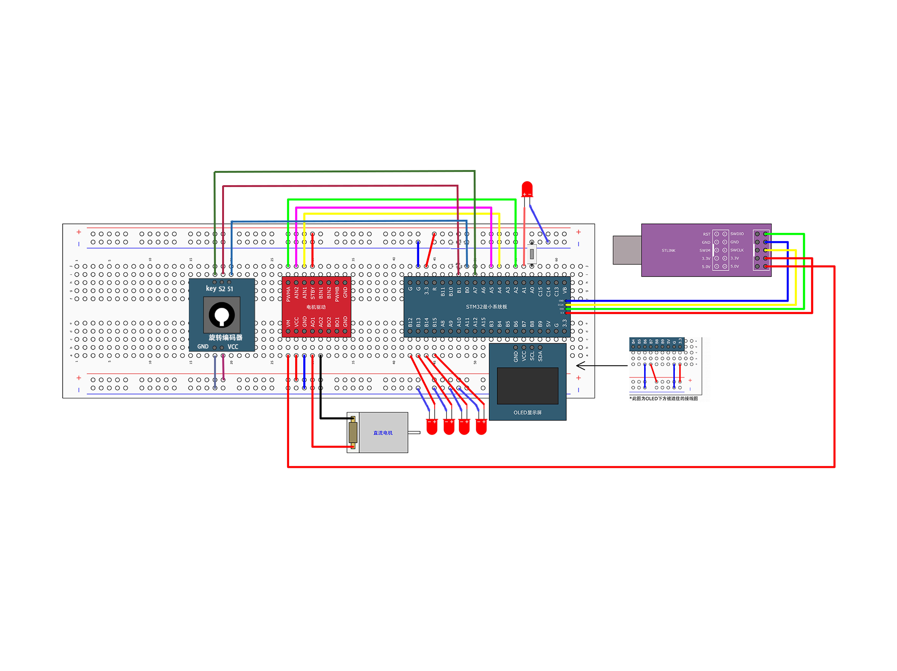

# 智能洗衣机

基于C8T6实现的智能洗衣机。

# 主要功能

## 流水灯欢迎效果
在启动和洗衣结束的时候会进行流水效果提示。

## 模式选择

通过A0按钮选择以下模式:

- **快洗**
- **慢洗**
- **标准洗**
- **强力洗**
- **柔洗**
- **热水洗**
- **冷水洗**

## 参数调节

可以通过旋转编码器调节以下参数:

- **定时**
- **转速**
- **温度**
- **水位**

# 使用方法

1. 通过`A0按钮`选择想要的`洗衣模式`。
2. 在`没有任何参数闪烁`的时候处于`启动和暂停模式`。旋转`旋转编码器`
   可以设置参数，参数设置好后按下旋转编码器的按钮跳转到下一个参数设置，直到所有的参数不闪烁(不闪烁表示返回启动和暂停模式)。
3. 在`启动和暂停模式`(没有任何参数闪烁的时候)下`按旋转编码器的按钮`可以启动和暂停洗衣。

# 接线图

